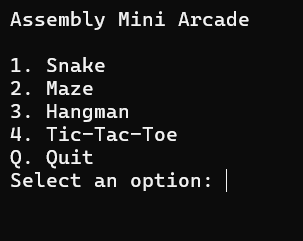
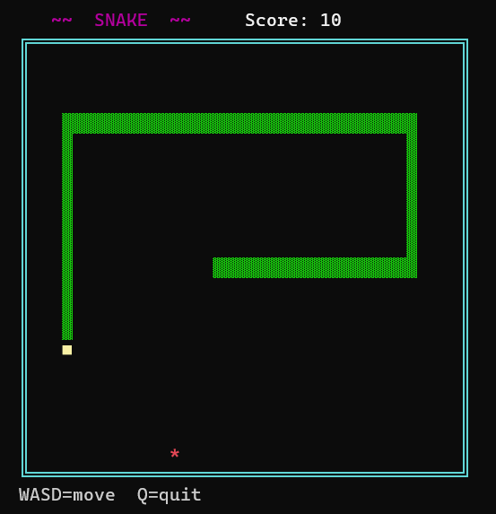
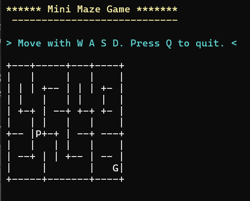
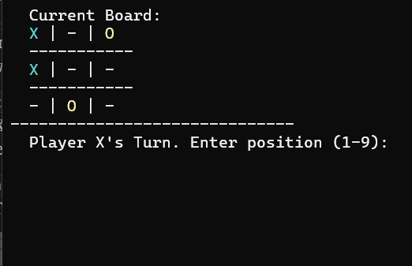
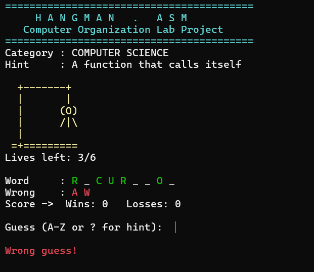

<div align="center">

# Assembly Mini Arcade

**A collection of console games written entirely in x86 Assembly**


*Four classic games. Zero high-level abstractions. Pure assembly.*

</div>

---

## About

Assembly Mini Arcade is a modular, menu-driven arcade suite built in x86 assembly (JWasm/JWLink, MASM-like syntax). Every game runs in a Windows console using ASCII rendering — no frameworks, no game engines, just registers, jumps, and interrupts.

This project was developed as part of **CS-341: Computer Organization and Assembly Language** at SEECS, NUST.

---

##  Games

| Game | Controls | Objective |
|------|----------|-----------|
|  **Snake** | `W A S D` to move, `Q` to quit | Eat food, grow longer, avoid walls and yourself |
|  **Maze** | `W A S D` to move, `Q` to quit | Navigate from `P` to `G` without hitting walls |
|  **Tic-Tac-Toe** | `1–9` to place, supports 2-player and AI mode | Get three in a row |
|  **Hangman** | Letter keys to guess, `?` for hint | Guess the CS keyword before the man hangs |

---

##  Project Structure

```
assembly-arcade/
├── src/
│   ├── main.asm              # Menu and entry point
│   └── games/
│       ├── snake.asm
│       ├── maze.asm
│       ├── hangman.asm
│       └── tictactoe.asm
├── scripts/
│   ├── build.ps1             # Build script (JWasm + JWLink)
│   └── bin/                  # Generated executables (git-ignored)
├── docs/                     # Documentation
├── how_to_run.md
└── README.md
```

---

##  Prerequisites

- **Windows** (tested on Windows 10/11)
- **Visual Studio Code** with the [MASM Runner](https://marketplace.visualstudio.com/items?itemName=istareatscreens.masm-runner) extension installed
- **PowerShell** (comes with Windows)

The build script automatically locates `JWASM.EXE` and `JWlink.exe` bundled with the MASM Runner extension. No manual PATH configuration needed.

---

##  Setup

**1. Clone the repository**
```powershell
git clone https://github.com/your-username/assembly-arcade.git
cd assembly-arcade
```

**2. Install MASM Runner in VS Code**

Open VS Code → Extensions (`Ctrl+Shift+X`) → Search `MASM Runner` → Install

**3. Verify the extension path exists**
```
%USERPROFILE%\.vscode\extensions\istareatscreens.masm-runner-*\native\JWASM\JWASM.EXE
```

---

## Building and Running

**Build the full arcade:**
```powershell
cd scripts
.\build.ps1
```

**Build a single game:**
```powershell
.\build.ps1 -Target snake
.\build.ps1 -Target maze
.\build.ps1 -Target hangman
.\build.ps1 -Target tictactoe
```

**Run:**
```powershell
.\scripts\bin\arcade.exe
```

---

##  Screenshots

<!-- Replace with actual screenshots -->
| Main Menu | Snake | Maze |
|-----------|-------|------|
|  |  |  |

| Tic-Tac-Toe | Hangman |
|-------------|---------|
|  |  |

---

##  Troubleshooting

| Error | Fix |
|-------|-----|
| `Syntax error: ` on line 1 | Source file has a UTF-8 BOM. See [how_to_run.md](how_to_run.md) to strip it |
| `masm-runner extension not found` | Install the MASM Runner extension in VS Code |
| `build.ps1 cannot be loaded` | Run `Set-ExecutionPolicy RemoteSigned` as Administrator |
| `SKIP (not found): x.asm` | File missing from `src/games/` — check your directory |

> **Note:** All `.asm` files must be saved as **UTF-8 without BOM**. JWasm will throw a syntax error on line 1 otherwise.

---

## Technical Highlights

- **Circular buffer** for snake body — O(1) movement, no shifting
- **LCG pseudo-random** food placement with overlap retry
- **Non-blocking input** via Win32 `GetNumberOfConsoleInputEvents`
- **Incremental rendering** — only redraws changed cells to reduce flicker
- **Flat byte-string maze** indexed by `(row × width) + col`
- **26-byte Boolean array** for O(1) duplicate guess detection in Hangman

---

##  Authors

<div align="center">

| Name | Roll Number |
|------|-------------|
| Waasila Asif | 502395 |
| Aman Ajmal | 503460 |
| Mehak Chaudhry | 501918 |
| Fatima Sajjad | 503676 |

**BSCS-14B · SEECS, NUST**

</div>

---

##  References

- Kip Irvine — *Assembly Language for x86 Processors*, Pearson
- Intel — *Intel 64 and IA-32 Architectures Software Developer's Manual*, 2023
- Randal Hyde — *The Art of Assembly Language Programming*, No Starch Press

---

<div align="center">
<sub>Built with frustration, debugged with more frustration, at SEECS NUST. 🫡</sub>
</div>